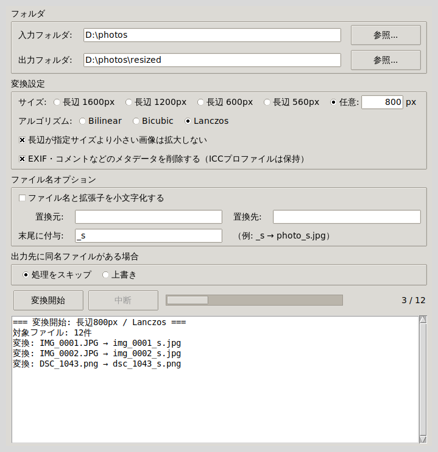

# 画像ツール（リサイズ・切り抜き・連結）

**リサイズ（JPG / PNG / WEBP のフォーマット変換つき）**・**切り抜き（クロップ）**・**連結** の3機能をタブで切り替える Windows 用 GUI ツール。

**C# 版（推奨）** と Python 版の2つがあり、機能は同じです。



## 使い方

### C# 版（推奨・インストール不要）

[Releases](https://github.com/HatoAttack/image-sizechange/releases) から `ImageResizer.exe` をダウンロードしてダブルクリックするだけ。ランタイム等のインストールは不要で、この exe 1個を他の PC にコピーしても動きます。

ソースは `csharp/` 以下（.NET 8 + WinForms + ImageSharp）。再ビルドは:

```
dotnet publish csharp/ImageResizer -c Release -r win-x64 --self-contained true -p:PublishSingleFile=true -p:IncludeNativeLibrariesForSelfExtract=true -p:EnableCompressionInSingleFile=true
```

動作テストは `dotnet run --project csharp/ImageResizer.Tests`。

### Python 版

`start_editor.bat` をダブルクリック（要 Python 3.10 以降 + Pillow）。ソースは `image_editor.py`（リサイズ処理は `image_resizer.py` を利用するため2ファイルを同じフォルダに置くこと）。

リサイズ単体版もあります: `start.bat`（ソースは `image_resizer.py`）。

## リサイズタブの機能

| 項目 | 内容 |
|---|---|
| 入力 | フォルダ単位（フォルダ直下の `.jpg` `.jpeg` `.png` `.webp` が対象） |
| サイズ | 長辺 1600 / 1200 / 600 / 560 px から選択、任意のピクセル数を直接指定、または「変更しない」 |
| 出力形式 | 元のまま / JPG / PNG / WEBP から選択（拡張子も合わせて付け替え） |
| アルゴリズム | Bilinear / Bicubic / Lanczos から選択 |
| ファイル名処理 | 小文字化（拡張子含む）・文字列置換・末尾に任意文字列付与 |
| 出力先 | 任意のフォルダを選択可能 |
| 同名ファイル | スキップ / 上書き を選択可能 |
| メタデータ削除 | EXIF・コメント等を削除（デフォルトON、チェックを外すと保持） |

## 補足

- ファイル名処理の適用順は「置換 → 末尾付与 → 小文字化」です。
- EXIF の回転情報は反映したうえで変換するため、メタデータを削除しても画像の向きは崩れません。
- メタデータ削除時も ICC プロファイル(色管理情報)は保持します。削除をオフにすると EXIF は保持されます。
  - C# 版では JPEG コメント(COM)は削除オフでも保持されません(ライブラリの仕様)。Python 版はオフなら保持します。
- 「拡大しない」チェックを外すと、長辺が指定より小さい画像も指定サイズまで拡大します。
- サイズで「変更しない」を選べばリサイズせず、フォーマット変換だけを行えます（例: WEBP を原寸のまま JPG へ）。
- 出力形式で JPG を選ぶと、透過部分は白で塗りつぶされます（JPEG は透過を扱えないため）。PNG / WEBP 出力では透過を保持します。
- 出力形式を変えると同名になる画像（`photo.jpg` と `photo.png` を両方 PNG へ など）は、「同名ファイル」の設定に従ってスキップまたは上書きされます。
- アニメーション WEBP は先頭フレームだけを静止画として変換します（アニメーションは保持されません）。
- WEBP は 16383px を超える寸法を保存できないため、それ以上の長辺を指定して WEBP 出力するとそのファイルはエラーになります。
- JPEG・WEBP は品質 90 で保存します。
- 入力フォルダ選択時、出力フォルダが未指定なら `入力フォルダ\resized` が自動入力されます。

## 切り抜きタブ

- 「画像を開く」で1枚以上の画像を読み込み、`◀前 / 次▶` で切り替え。
- 画像ファイルやフォルダをタブ上へ**ドラッグ＆ドロップ**しても読み込めます（フォルダは直下の画像を名前順に読み込み）。Python 版は `pip install tkinterdnd2` が必要です（未インストールでもD&D以外は動作）。
- 画像上をマウスドラッグで範囲選択。枠内ドラッグで移動、四隅のハンドルでサイズ変更。
- アスペクト比は **自由 / 1:1 / 4:3 / 3:2 / 16:9 / 任意（W:H 入力）** から選択。「縦横を反転」チェックで縦向き（4:3 → 3:4 など、任意比にも適用）になります。比を固定するとドラッグ中も比率を保ちます。
- 「この範囲で保存」で表示中の画像を、「全画像を同比率で中央切り抜き保存」で読み込んだ全画像を選択中の比率で中央クロップして一括保存します。
- 出力先は任意フォルダ（既定は `元フォルダ\cropped`）。ファイル名は `元の名前_crop.拡張子`。

## 連結タブ

複数画像を1枚に連結します（参考: フォトコンバイン）。

| 項目 | 内容 |
|---|---|
| 並べ方 | 横 / 縦 / グリッド（列数指定） |
| サイズ揃え | 横=高さ・縦=幅を「そのまま / 小さい方 / 大きい方 / 指定px」で統一。グリッドは「元の最大 / セルを指定px角」 |
| 整列 | 横=上/中央/下、縦=左/中央/右（サイズが不揃いのとき有効） |
| 間隔 / 外余白 | 画像間の間隔、外周の余白をpxで指定 |
| 背景色 | 余白・間隔に適用（カラーピッカー対応）。「背景を透過（PNG）」も可 |
| 出力形式 | PNG / JPEG / WEBP（JPEGは透過を白で塗りつぶし） |

「プレビュー」で結果を確認し、「連結して保存...」で書き出します。

## 切り抜き・連結の補足

- 読み込み時に EXIF の回転情報を反映します。
- 対応形式: JPG / PNG / WEBP / BMP / GIF（読み込み）。
- グリッドは各画像をセル内に収まるよう縮小（アスペクト比保持）して中央配置します。
